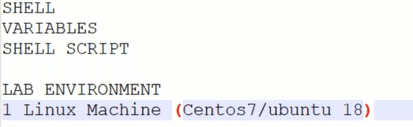
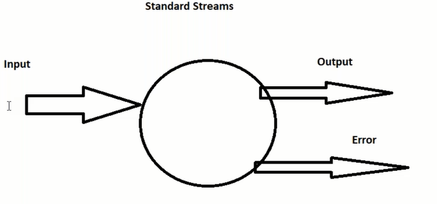
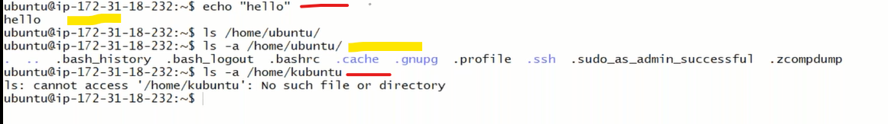
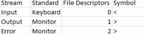
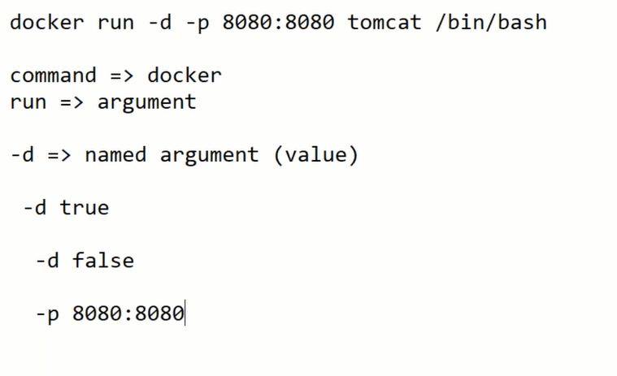
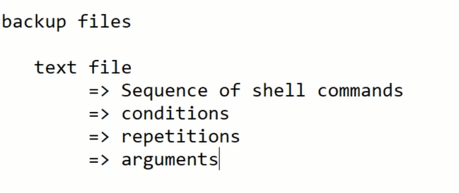

# linux 

# steam

#### Example

---
* echo Hello (input steam)
* hello (output steam)
* ls -a /home/ubuntu (its open available files)
* ls -a /home/kbuntu (its shows no directory found) this is called error steam
---

#### linux command sheet 
[clickhere](https://www.loggly.com/wp-content/uploads/2015/05/Linux-Cheat-Sheet-Sponsored-By-Loggly.pdf)

#### when you run and input requried
* ping google.com
   * command (ping)
   * argument (google.com)
#### argument 
* they are two types of argument
   * positional (1 2 3)
      * this is fixed argument 
      * example : aws create ec2 instance 
   * named argument(-i )
      * this is named argument 
    #### example : 
    ---
    -n "name" -i "path of pem file"..etc
    
    ---
    #### exmple 2
    
    ---
    

    ---

    

