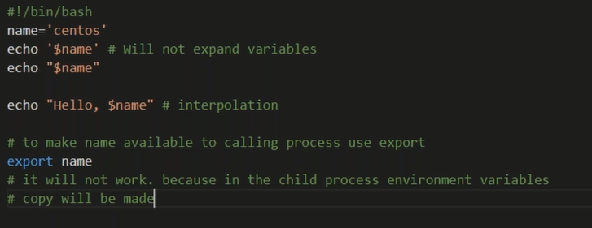

##  variable
*  A variable is nothing more than a pointer to the actual data. The shell enables you to create, assign, and delete variables.
## Variable Names
* The name of a variable can contain only letters (a to z or A to Z), numbers ( 0 to 9) or the underscore character ( _).
* By convention, Unix shell variables will have their names in UPPERCASE.

  * The following examples are valid variable names −
     ### example:
     * _ALI
     * TOKEN_A
     * VAR_1
     * VAR_2
   * Following are the examples of invalid variable names −
       ### example: 
        * 2_VAR
        * -VARIABLE
        * VAR1-VAR2
        * VAR_A!
## Defining Variables
* Variables are defined as follows −

* variable_name=variable_value
### For example:

* NAME="Zara Ali"

iteam count = 10 

# Variable Types
## When a shell is running, three main types of variables are present

#### Local Variables :
* A local variable is a variable that is present within the current instance of the shell. It is not available to programs that are started by the shell. They are set at the command prompt.

#### Environment Variables:
 * An environment variable is available to any child process of the shell. Some programs need environment variables in order to function correctly. Usually, a shell script defines only those environment variables that are needed by the programs that it runs.

#### Shell Variables 
* A shell variable is a special variable that is set by the shell and is required by the shell in order to function correctly. Some of these variables are environment variables whereas others are local variables.

## sample 
