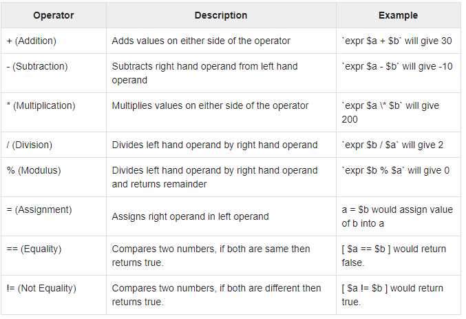
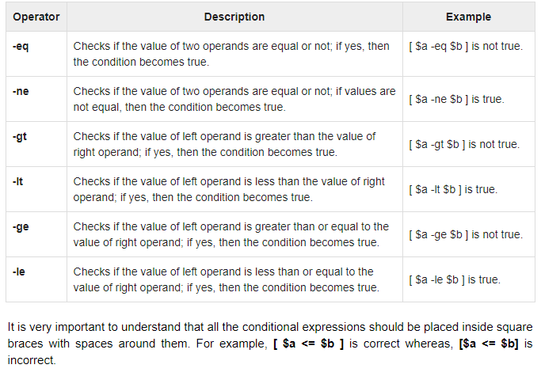
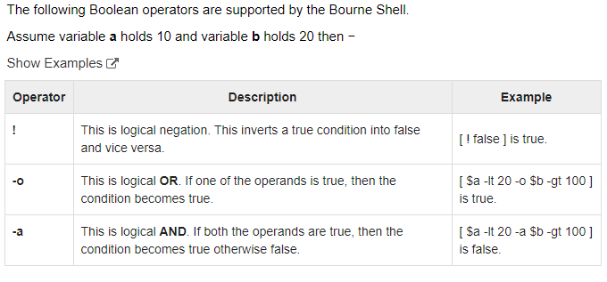
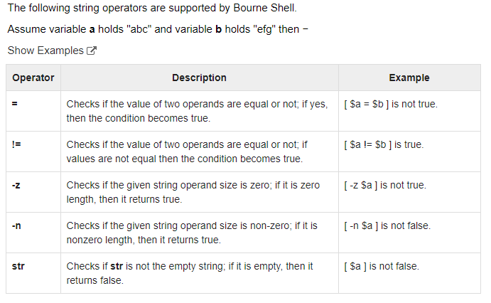
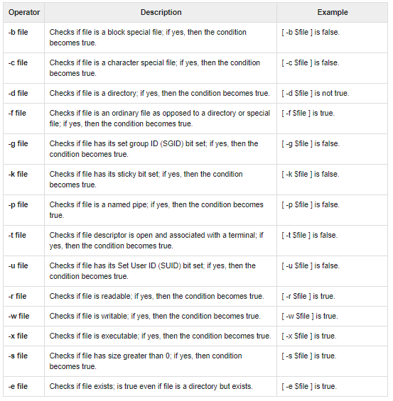

# Shell Basic Operators
* There are various operators supported by each shell. We will discuss in detail about Bourne shell (default shell) in this chapter.

#### We will now discuss the following operators :
----
    Arithmetic Operators
    Relational Operators
    Boolean Operators
    String Operators
    File Test Operators
-----
* Bourne shell didn't originally have any mechanism to perform simple arithmetic operations but it uses external programs, either awk or expr.

#### The following example shows how to add two numbers :

    #!/bin/sh

    val=`expr 2 + 2`
    echo "Total value : $val"

#### The above script will generate the following result:

    Total value : 4
* The following points need to be considered while adding :

    * There must be spaces between operators and expressions. 
        * For example, 2+2 is not correct; it should be written as 2 + 2.

    * The complete expression should be enclosed between ‘ ‘, called the backtick.

#### Arithmetic Operators
* The following arithmetic operators are supported by Bourne Shell.

* Assume variable a holds 10 and variable b holds 20 then.

---

* It is very important to understand that all the conditional expressions should be inside square braces with spaces around them, for example [ $a == $b ] is correct whereas, [$a==$b] is incorrect.

* All the arithmetical calculations are done using long integers.
---

# Relational Operators
* Bourne Shell supports the following relational operators that are specific to numeric values. These operators do not work for string values unless their value is numeric.

#### For example, 
* following operators will work to check a relation between 10 and 20 as well as in between "10" and "20" but not in between "ten" and "twenty".

* Assume variable a holds 10 and variable b holds 20 then −

#### Show Examples:

#### Boolean Operators:

#### String Operators:

### File Test Operators:

* We have a few operators that can be used to test various properties associated with a Unix file.

* Assume a variable file holds an existing file name "test" the size of which is 100 bytes and has read, * write and execute permission on

#### C Shell Operators :
* We will now list down all the operators available in C Shell. Here most of the operators are very similar to what we have in C Programming language.
[clickhere](https://www.tutorialspoint.com/unix/unix-c-shell-operators.htm)

#### Korn Shell Operators
[clichhere](https://www.tutorialspoint.com/unix/unix-korn-shell-operators.htm)

