# INTRODUCTION 
---
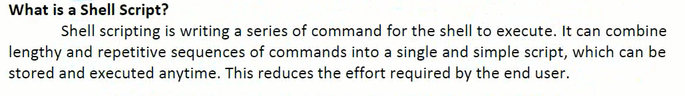

## KERNEL
---
* kernel is the hart of linux O/S 
* it manages resources of linux O/S 
  * resources mean facilites available in linux 
  * example : facility to store data, print data on printer, memory and file managment ..etc

---

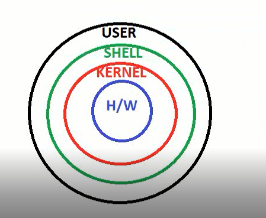

## This is shell what does for us 
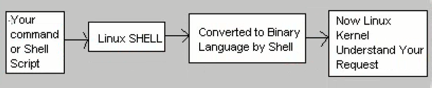

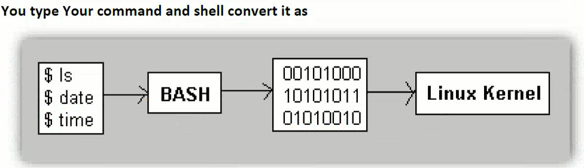

--- 
* its environment provided for user interaction
* shell is a command language interpreter that executes commands read from the standard input device (keyboard)or(from a file)

----

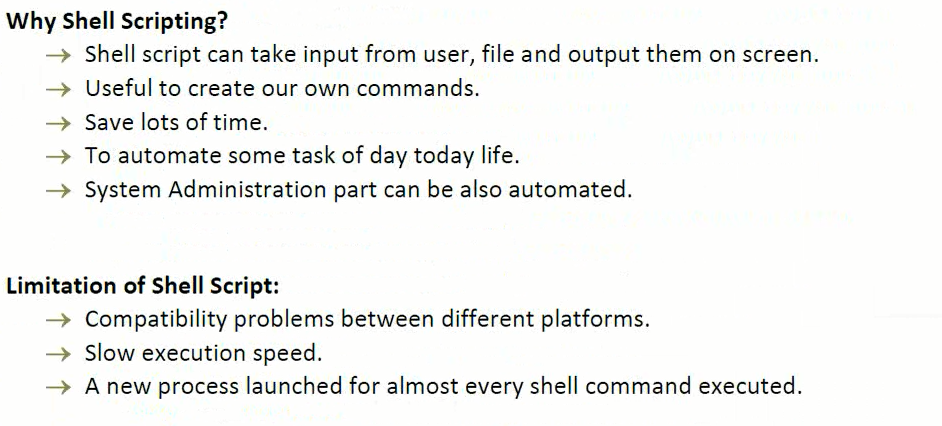

## Types of shells in Linux
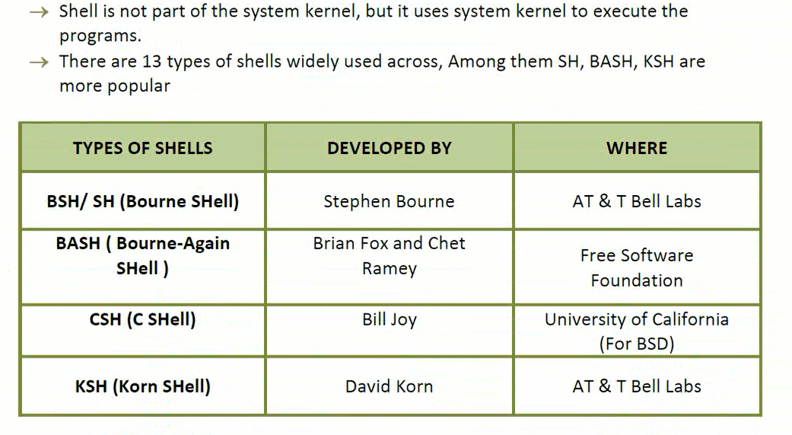

## Basic commands for shell
---
To find which type of shell on your linux machine 
   * echo $SHELL (Defult shell)
   * echo $0 (current shell)
   * cat /etc/shells (its shows how many shells are installed)
   * chsh (change defult shell(passwd required)) or (usermod -s /bin/bash myuser(admin permission required))
---

## example for shell for mutiple adduser (for loop) 
---
* for i in u1 u2 u3 u4 
* do
* useradd $i

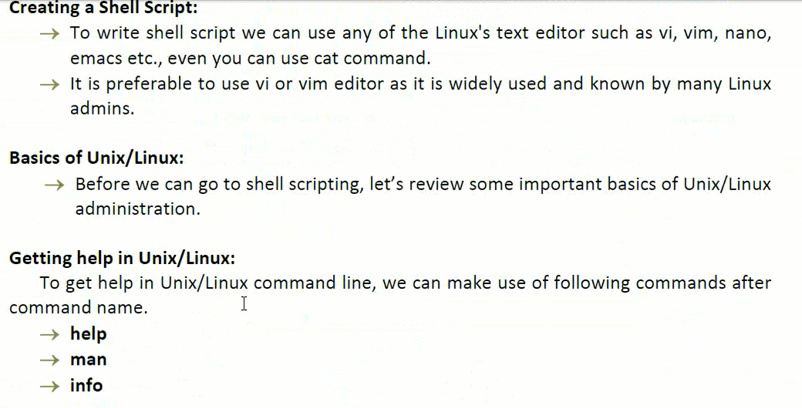

## To Create script 

* vim script-name.sh or vi script-name.sh
---
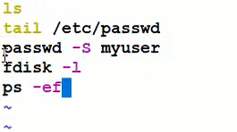

* :wq! (save & exist)
## file types supported for linux 

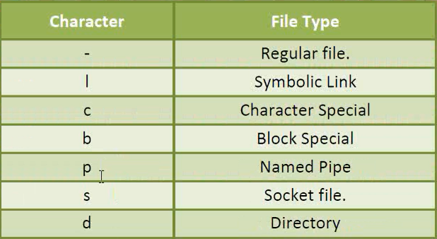

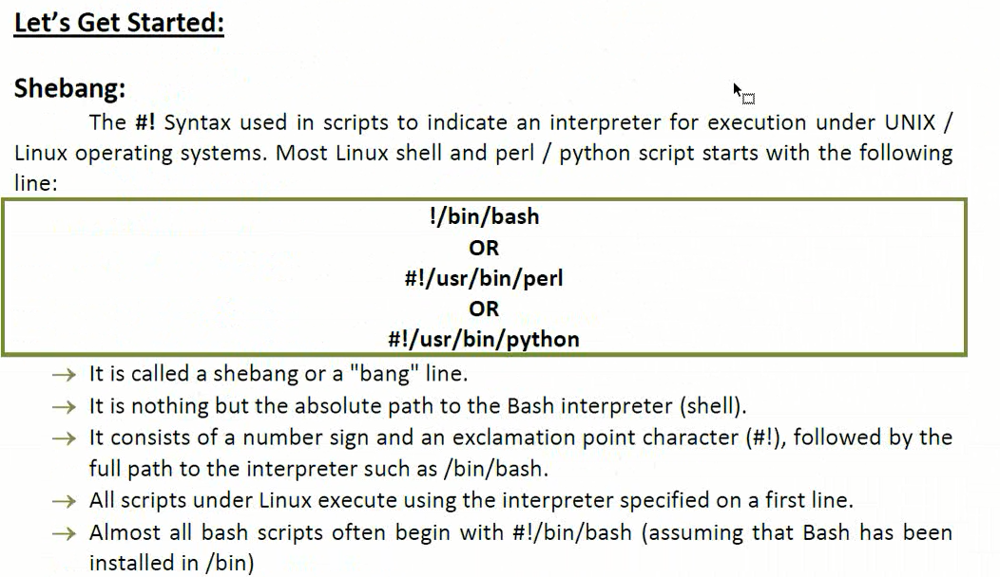

## Requried for run shell file
---
* create file : vim shellscript.sh (.sh is identy for checking file we are using)
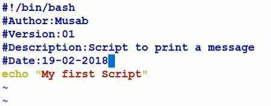
#### !/bin/bash  (its helps where to exective script)
* To run shell file  & its fail due if file did not have exectue permission

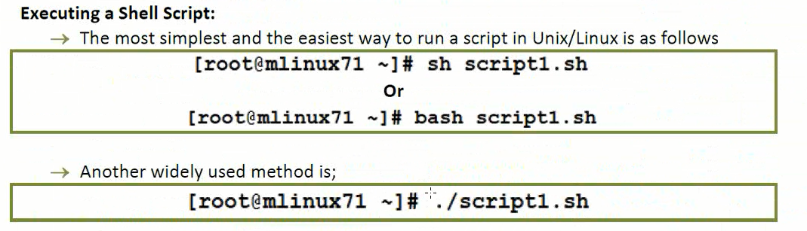

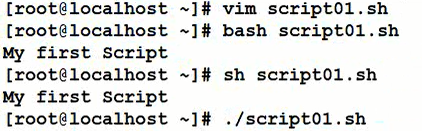 

